# 🏢 Unify ERP Management System

A full-featured **Enterprise Resource Planning (ERP)** web application built with React, Redux Toolkit, and Material UI. Designed to help businesses manage products, customers, sales, purchases, invoices, and goods receipts — all from a single, unified dashboard.

---

## 🚀 Live Demo

> [Live Demo](https://drive.google.com/file/d/1Wjo5oBpbFxycWOby1FdgnoWQclmIqKn8/view?usp=drive_link)

---

## 📸 Screenshots
### Register
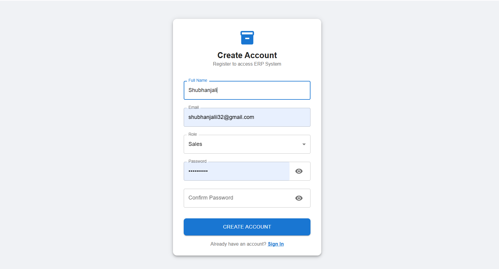

### Login 
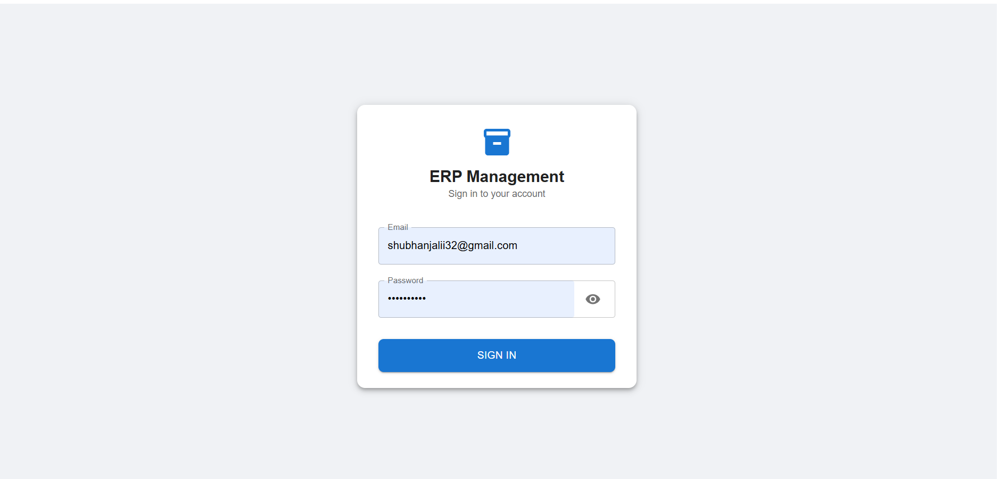

### Users 
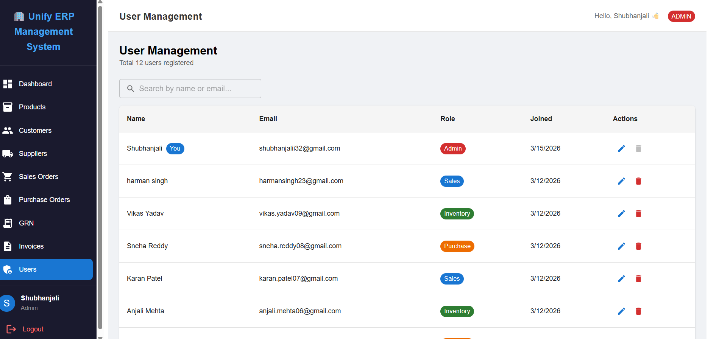
### Dashboard
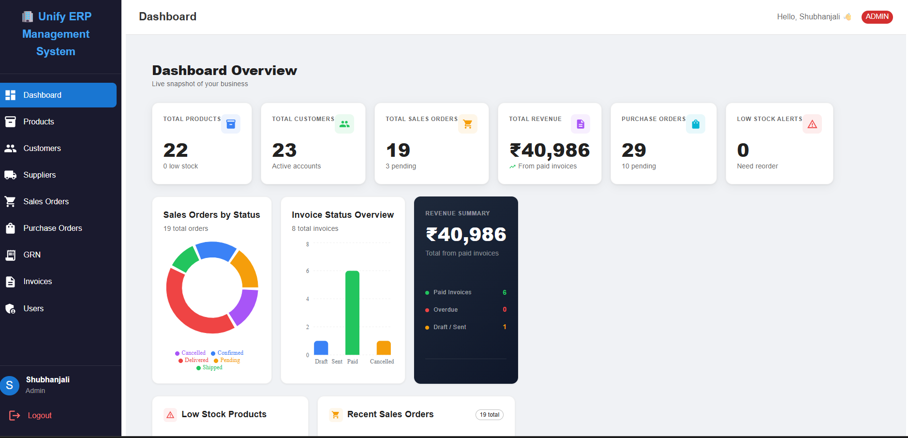
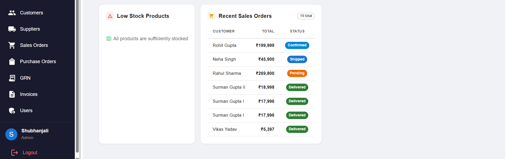

### Invoices
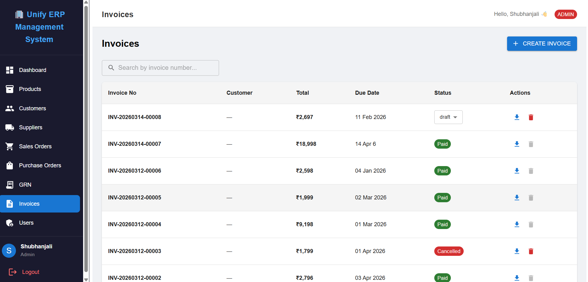

### Products
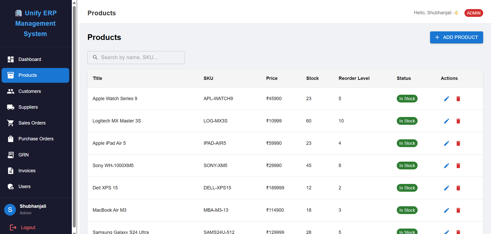

### Suppliers
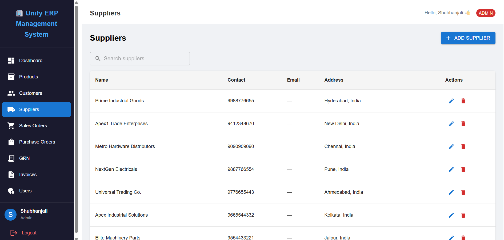

### Purchage Orders
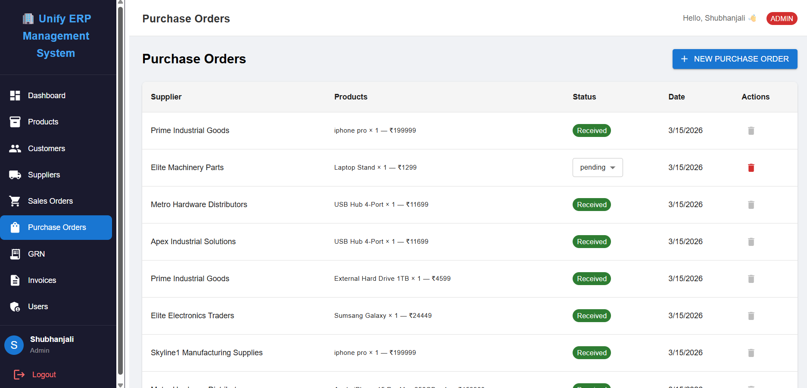

### Sales Orders
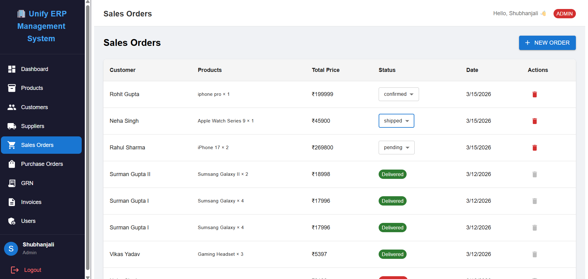

### Grns
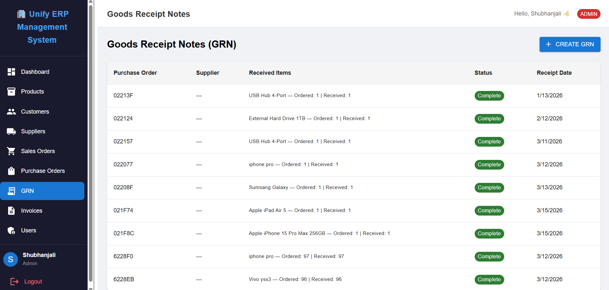

### Invoice Pdf
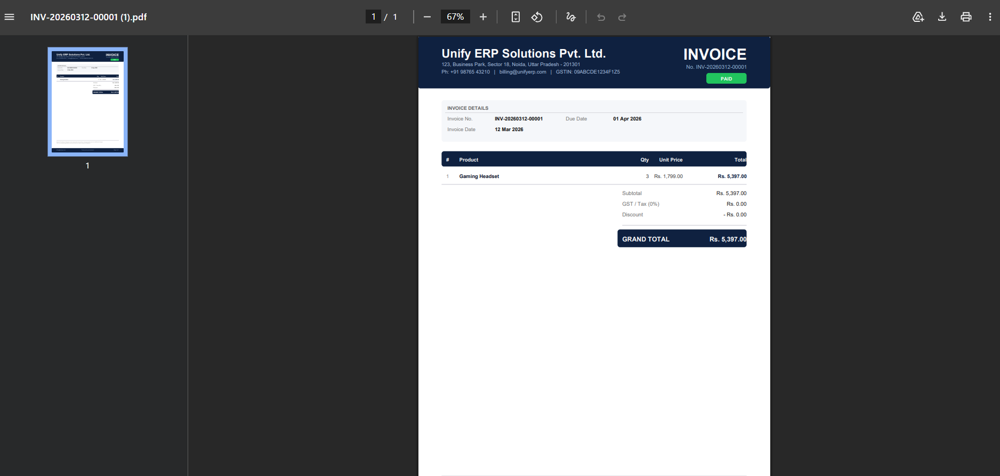
---

## ✨ Features

### 📊 Dashboard
- Real-time overview of key business metrics
- Stat cards: Total Products, Customers, Sales Orders, Revenue, Purchase Orders, Low Stock Alerts
- **Sales Orders by Status** — Donut chart (Recharts)
- **Invoice Status Overview** — Bar chart with color coding
- Revenue Summary panel with paid/overdue/draft breakdown
- Low Stock Products table with reorder alerts
- Recent Sales Orders with live status chips

### 📦 Products 
- Add, edit, delete products
- Track stock levels and reorder thresholds
- Low stock detection and alerts

### 👥 Customers
- Full customer management (CRUD)
- Customer details including contact and address

### 🛒 Sales Orders
- Create and manage sales orders
- Status tracking: Pending → Confirmed → Shipped → Delivered → Cancelled
- Linked to customers and products

### 🛍️ Purchase Orders
- Manage purchase orders from suppliers
- Status tracking and pending order count

### 📄 Invoices
- Auto-generate invoices from sales orders
- Status management: Draft → Sent → Paid → Overdue → Cancelled
- **PDF Invoice Generator** using jsPDF
  - Professional header with company branding
  - Invoice details, itemized table, GST/tax, discount, grand total
  - Terms & conditions and footer
- Search invoices by invoice number

### 📬 GRN (Goods Receipt Note)
- Record and track received goods against purchase orders

### 👤 Users
- User management with role-based access (Admin, etc.)

---

## 🛠️ Tech Stack

| Layer | Technology |
|-------|-----------|
| Framework | React 18 (Vite) |
| State Management | Redux Toolkit |
| UI Library | Material UI (MUI v5) |
| Charts | Recharts |
| PDF Generation | jsPDF |
| Routing | React Router DOM |
| HTTP Client | Axios |
| Icons | MUI Icons |

---

## 📁 Fronted Project Structure

```
frontend/
├── public/
├── src/
│   ├── app/
│   │   └── store.js                  # Redux store
│   ├── components/
│   │   ├── Sidebar.jsx               # Navigation sidebar
│   │   └── Layout.jsx                # App layout wrapper
│   ├── features/
│   │   ├── products/
│   │   │   └── productSlice.js
│   │   ├── customers/
│   │   │   └── customerSlice.js
│   │   ├── salesOrders/
│   │   │   └── salesOrderSlice.js
│   │   ├── purchaseOrders/
│   │   │   └── purchaseOrderSlice.js
│   │   ├── invoices/
│   │   │   └── invoiceSlice.js
│   │   └── grn/
│   │       └── grnSlice.js
│   ├── pages/
│   │   ├── dashboard/
│   │   │   └── DashboardPage.jsx
│   │   ├── products/
│   │   │   └── ProductsPage.jsx
│   │   ├── customers/
│   │   │   └── CustomersPage.jsx
│   │   ├── salesOrders/
│   │   │   └── SalesOrdersPage.jsx
│   │   ├── purchaseOrders/
│   │   │   └── PurchaseOrdersPage.jsx
│   │   ├── invoices/
│   │   │   ├── InvoicesPage.jsx
│   │   │   └── InvoiceDetail.jsx
│   │   ├── grn/
│   │   │   └── GRNPage.jsx
│   │   └── auth/
│   │       └── LoginPage.jsx
│   ├── utils/
│   │   └── helper.js
│   ├── App.jsx
│   └── main.jsx
├── .env
├── package.json
└── vite.config.js
```

---

## ⚙️ Getting Started

### Prerequisites
- Node.js >= 18
- npm or yarn
- Backend API running 

### Installation

```bash
# Clone the repository
git clone https://github.com/Shubhanjali801/Design-and-Implementation-of-UnifyERP-A-Web-Based-Enterprise-Resource-Planning-System

# Navigate to project folder
cd Design-and-Implementation-of-UnifyERP-A-Web-Based-Enterprise-Resource-Planning-System

# Install dependencies
npm install
```

### Environment Variables frontend

Create a `.env.production` file in the root:

```env
VITE_API_URL=https://erp-backend2-lbxe.onrender.com
```

### Run Development Server

```bash
npm run dev
```

App runs at `http://localhost:5173`

### Build for Production

```bash
npm run build
```

---

## 🔗 Backend and 📁 Project Structure

```
erp-management-system
│
├── client (React Frontend)
│   ├── public
│   │
│   ├── src  
│   │   ├── assets
│   │   │   ├── images
│   │   │   └── icons
│   │   │
│   │   ├── components
│   │   │   ├── Navbar.jsx
│   │   │   ├── Sidebar.jsx
│   │   │   ├── Product.table.jsx
│   │   │   ├── Customer.table.jsx
│   │   │   └── Protected.route.jsx
│   │   │
│   │   ├── pages
│   │   │   ├── Dashboard.jsx
│   │   │   ├── Products.jsx
│   │   │   ├── Customers.jsx
│   │   │   ├── Suppliers.jsx
│   │   │   ├── Sales.orders.jsx
│   │   │   ├── Purchase,orders.jsx
│   │   │   ├── GRN.jsx
│   │   │   ├── Invoices.jsx
│   │   │   ├── Login.jsx
│   │   │   └── Register.jsx
│   │   │
│   │   ├── redux / context
│   │   │   ├── store.js
│   │   │   └── authSlice.js
│   │   │
│   │   ├── services
│   │   │   ├── api.js
│   │   │   ├── product.service.js
│   │   │   ├── order.service.js
│   │   │   └── auth.service.js
│   │   │
│   │   ├── utils
│   │   │   └── helpers.js
│   │   │
│   │   ├── App.jsx
│   │   └── main.jsx
│   │
│   └── package.json
│
│
├── server (Node + Express Backend)
│   │
│   ├── config
│   │   └── db.js
│   │
│   ├── controllers
│   │   ├── auth.controller.js
│   │   ├── product.controller.js
│   │   ├── customer.controller.js
│   │   ├── supplier.controller.js
│   │   ├── sales.order.controller.js
│   │   ├── purchase.order.controller.js
│   │   ├── grn.controller.js
│   │   └── invoice.controller.js
│   │
│   ├── models
│   │   ├── User.js
│   │   ├── Product.js
│   │   ├── Customer.js
│   │   ├── Supplier.js
│   │   ├── Sales.order.js
│   │   ├── Purchase.order.js
│   │   ├── GRN.js
│   │   └── Invoice.js
│   │
│   ├── routes
│   │   ├── auth.routes.js
│   │   ├── product.routes.js
│   │   ├── customer.routes.js
│   │   ├── supplier.routes.js
│   │   ├── sales.order.routes.js
│   │   ├── purchase.order.routes.js
│   │   ├── grn.routes.js
│   │   └── invoice.routes.js
│   │
│   ├── middleware
│   │   ├── auth.middleware.js
│   │   ├── role.middleware.js
│   │   └── error.middleware.js
│   │
│   ├── utils
│   │   └── generate.token.js
│   │
│   ├── server.js
│   └── package.json
│
│
└── README.md 
```

This frontend connects to a Node.js + Express + MongoDB backend.

> 🔗 [Backend Repo: ](https://github.com/Shubhanjali801/Design-and-Implementation-of-UnifyERP-A-Web-Based-Enterprise-Resource-Planning-System/tree/main/backend)

---

## 📃 API Modules

| Module | Endpoint |
|--------|---------|
| Products | `/api/products` |
| Customers | `/api/customers` |
| Sales Orders | `/api/sales-orders` |
| Purchase Orders | `/api/purchase-orders` |
| Invoices | `/api/invoices` |
| GRN | `/api/grn` |
| Users / Auth | `/api/users` |

---

## 🧑‍💻 Author

**Shubhanjali**
- Role: Admin
- Project: Unify ERP Management System

---

## 📄 License

This project is for educational/personal use.  
Feel free to fork and build upon it!

---

> Built with ❤️ using React + Redux + MUI
